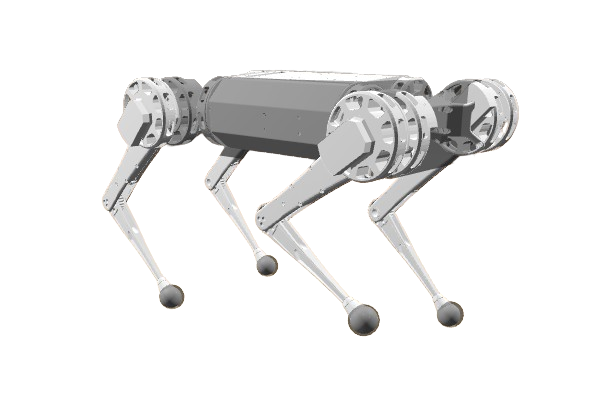

# Model Predictive control for Quadruped

### About
This project was done as my course project at UPenn for MEAM 5170: Controls and Optimization with application in AI and Robotics.

This was my first attempt at implementing MPC from scrach using [Drake simulation software](https://drake.mit.edu/).  
I had a hard time tuning and making it work, wasn't able to make it walk. Still, below are some decent screenshots of the working controller for basic standing with different poses.

- Standing on three legs.  

References:
- [Dynamic Locomotion in the MIT Cheetah 3 Through Convex Model-Predictive Control](https://dspace.mit.edu/bitstream/handle/1721.1/138000/convex_mpc_2fix.pdf)
- https://github.com/vincekurtz/quadruped_drake/
- https://github.com/yinghansun/pympc-quadruped/
